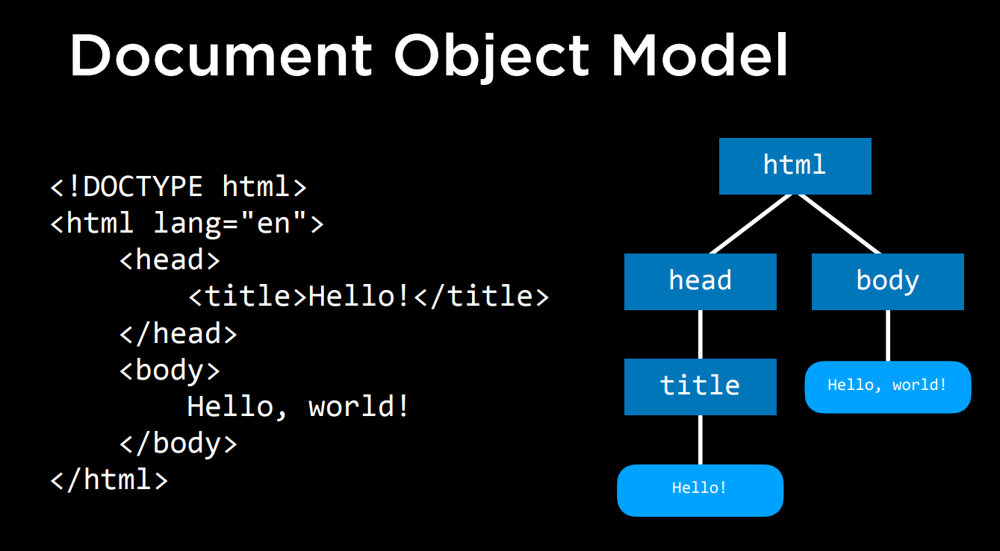

# HTML and CSS
HTML is about structure and CSS is about styles.

How to open the page inside of the web browser:
```
open name_of_file.html # if in linux
start name_of_file.html # if in windows
```

## HTML new Points
The doctype shows which version of html we are using: if no specification is provided we are using the latest version.
```
<!DOCTYPE html>
```

Every HTML tag starts with `<>` and ends with `</>`.
Some tags have attributes.

```
<html lang="en">
```

The `<head>` shows some important points of the web page.

## DOM: Document Object Model
Is like the structure of the webpage.
The identation is not necessary, but is useful for whoever is reading.

Javascript will allow us to change the structure when necessary.

## Sizes
The size is defined by `<h1>`, `<h2>`, etc...
```
<h1> biggest heading </h1>
<h2> second biggest heading </h2>
```

## Lists
HTML has ordered and unordered lists.
ol: ordered list.
li: list item (used to designate each item)
```
<body>
    An unordered list:
    <ul>
        <li>One Item.</li>
        <li>Another Item.</li>
        <li>Still Another Item.</li>
    </ul>
    An ordered list:
    <ol>
        <li>First Item.</li>
        <li>Second Item.</li>
        <li>Third Item.</li>
    </ol>
```

## Images
*html file: image.html*
The image must always have the source and the alt:
```
 
```

The alt is used to show something to the user when the image is not available.

## Links to pages
*html file: link.html*
We use the `a` tag. The a tag is also called the anchor tag.
The anchor tag takes one important attribute: `href`, which specifies to which page we want to link.
Furthermore, we also specify what we want the user to see right after.

```
<a href="https://cs50.harvard.edu/web/2020/">Click to enter CS50W</a>
```

## Table
*html file: table.html*
A table is specified by the tags `<table>`, `<thead>`, `<tbody>` in which we add elements.
The `<thead>` has the table head elements `<th>`.
The `<tbody>` has the table rows `<tr>` and the table cells `<td>`.
```
<table>
    <thead>
        <th>Ocean</th>
        <th>Average Depth</th>
        <th>Maximum Depth</th>
    </thead>
    <tbody>
        <tr>
            <td>Pacific Ocean</td>
            <td>4280 m</td>
            <td>17920 m</td>
        </tr>
        <tr>
            <td>Atlantic Ocean</td>
            <td>1210 m</td>
            <td>3210 m</td>
        </tr>
    </tbody>
</table>
```

## Form
*html file: form.html*
A way for users to add information.
The form:
- placeholder: what will be shown to the user.
- type: what type of form we will have.
- name: this will not be displayed to the user but will be available in the database.

```
<body>
    <form>
        <input type="text" placeholder="Full name" name="full_name">
        <input type="submit">
    </form>
</body>
```

# CSS
*html file: style.html*
We use the newest version of CSS, which is CSS 3.
CSS is short for (Cascading Style Sheets).

We use CSS inside of HTML. Therefore, we can transform this:
```
<!DOCTYPE html>
<html>
    <head>
        <title>Hello</title>
    </head>
    <body>
        <h1>Welcome to my page!</h1>
        Hello, world!
    </body>
</html>
```

To this:
```
<!DOCTYPE html>
<html>
    <head>
        <title>Hello</title>
    </head>
    <body style="color:cadetblue; text-align: end;">
        <h1 style="color:cornflowerblue; text-align: center;">Welcome to my page!</h1>
        Hello, world!
    </body>
</html>
```

The changes can be in the entire page or some particular item.
The hierarquy is always from the smallest element to the biggest.

Neverthless, when building bigger applications, we want to write the style code just once. Therefore, steady of writing "in-line "styling", we can write it outside.

*html file: style_page.html*

We do that by specifying that in the head using style:
```
<!DOCTYPE html>
<html>
    <head>
        <title>Hello!</title>
        <style>
            h1 {
                color: pink;
                text-align: center;
            }
            h2 {
                color: violet;
                text-align: center;
            }
            h3 {
                color: blueviolet;
                text-align: center;
            }
        </style>
    </head>
    <body>
        <h3>In Wedneday</h3>
        <h2>We wear</h2>
        <h1>PINK</h1>
    </body>
</html>
```

Neverthless, we can still make a improvement...
We can take the CSS code and take it inside a CSS file.

In that case, we use a link to a style sheet to this page. We use that with "rel", which is the relationship.

*html file: style_webapplication.html*
*html file: styles.css*

```
<title>Hello!</title>
<link rel="stylesheet" href="styles.css">
```

## Size
CSS is also used to control sizes.
In the following, we use `<div>` as a division of our web application. In the style, we can specify the attributes of div as well.

In the div, margin is outside the "box" and padding is a inside "margin".

```
<!DOCTYPE html>
<html>
    <head>
        <title>Size</title>
        <style>
            div {
                background-color: blanchedalmond;
                width: 200px;
                height: 200px;
                margin: 20px;
                padding: 20px;
            }
            h1 {
                text-align: center;
            }
        </style>
    </head>
    <body>
        <div>
            <h1>Hello!</h1>
        </div>
    </body>
</html>
```

After we can also add fonts to the whole body or just to a division.
```
div {
    background-color: blanchedalmond;
    width: 200px;
    height: 200px;
    margin: 20px;
    padding: 20px;
    font-family: Arial, Helvetica, sans-serif;
    font-weight: bold;
    font-size: 28;
}
```
The font-family has more than one font because the second or third can be used if the browser does not support the previous.

Moreover, we can add lines, borders, etc...

```
div {
    border: 0.5px solid rgb(255, 209, 141);
```

## CSS in Tables
We can do the same with tables.

*html file: table_styled.html*

In that way, we can add attributes to a table.

```
table {
    border: 1px solid rgb(0, 162, 255);
    border-collapse: collapse;
}
td, th {
    border: 0.8px solid rgb(0, 162, 255);
    padding: 5px;
}
```

## Reference ID
We can reference a HTML element with an id. In that way, we can reference it later to a CSS. The id must be unique in that page.

On the other hand, a class can be reference multiple times.
A class is referenced in style with "." and a id is referenced with a "#".

*html file: reference.html*

<!DOCTYPE html>
<html lang="en"></html>
<head>
    <title>Hello!</title>
    <style>
        #happy {
            color: green;
            font-family: Arial, Helvetica, sans-serif;
            font-weight: bold;
            text-align: center;
        }
        .new_year {
            color: rgb(177, 0, 0);
            font-family: Arial, Helvetica, sans-serif;
            font-weight: bold;
            text-align: center;
        }
    </style>
</head>
<body>
    <h1 id="happy">Happy</h1>
    <h1 class="new_year">New</h1>
    <h1 class="new_year">Year!</h1>
</body>

## Specificity
When there is a h1 style tag and an id that are conflited. Therefore, there is a specificity order:
- inline;
- id;
- class;
- type (meaning a style in the order or somewhere else)

## CSS Selectors: Descendant
Used to style some attribute which are inside others.
*html file: descendant.html*
Example: only elements that are inside unordered lists.
```
ul > li {
    color: blue
}
```

`ul > li`: means a direct children.
`ul li`: means a direct or indirect children (grandchildren elements).

## CSS Selectors: Attribute
We can specify an attribute (link) that will have a different color from every other link.
*html file: descendant.html*
```
<style>
    a {
        color: blueviolet;

    }
    a[href="https://www.linkedin.com/"] {
        color: green
    }
</style>
```

## Hover: elements that changed when there is a hoover
Make objects that change when interacted with.
```
<style>
    button {
        width: 200px;
        height: 50px;
        font-size: 24px;
        background-color: rgb(3, 204, 144);
        color: white;
    }
    button:hover {
        background-color: rgb(212, 212, 212);
        color: rgb(3, 204, 144);
    }
</style>
```

# Responsive Design
Make sure that the web page looks good no matter how you look at the web page.
Today, peoople look at web pages in different devices.
Viewport: from where we can see the image.

To accomplish better results, we should add the following line in the style:
```
<meta name="viewport" content="width=device-width, initial-scale=1.0">
```

Furthermore, we can use Media Queries
## Media Queries
How our page is going to look depending on how we render that particular page.

The page should look different based on a size of the screen. Example: change the color of the screen:

```
h1 {
    font-family: Arial, Helvetica, sans-serif;
    text-align: center;
}
@media (min-width: 600px) {
    body {
        background-color: green;
        color: aliceblue
    }
}
@media (max-width: 599px) {
    body {
        background-color: rgb(194, 0, 0);
    }
    h1 {
        color: aliceblue;
    }
}
```

## Flexbox
When in mobile screen, have the elements in two or more rolls:

```
#container {
    display: flex;
    flex-wrap: wrap;
}

#container > div {
    background-color: darkgray;
    font-size: 20px;
    margin: 20px;
    padding: 20px;
    width: 50px;
}
```

Alternatively, we can have fixed columns and columns that ajust with the size of the page:
```
#grid {
    background-color: aliceblue;
    display: grid;
    grid-column-gap: 20px;
    grid-template-columns: 200px 200px auto;
}
```

# Bootstrap
It is a library. It can be included in the style. It already has lots of classes available!
To use it, we just need to add the following in the style part:
```
<link href="https://cdn.jsdelivr.net/npm/bootstrap@5.3.0-alpha1/dist/css/bootstrap.min.css" rel="stylesheet" integrity="sha384-GLhlTQ8iRABdZLl6O3oVMWSktQOp6b7In1Zl3/Jr59b6EGGoI1aFkw7cmDA6j6gD" crossorigin="anonymous">
```

## Bootstrap Column Module
Bootstrap even lets you have responsive pages.
Bootstrap divides the page into to 12 parts.
This is done by using classes of "col-X" being X a number between 1 and 12 inside the divs.

This can address mobiles as well. This is because we can use different amount of column size if the screen is large or if the screen is small:
```
<div class="col-lg-3 col-sm-6">
```
In a smaller screen, the column should take 6 units while in a big screen it should take only in 3.

## Avoid Redudance


